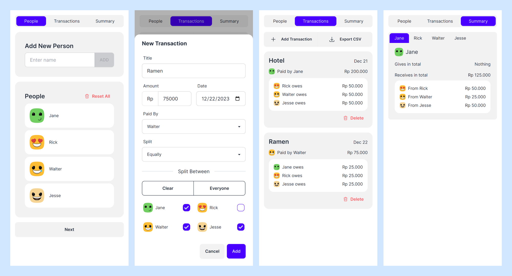

# Debt Simplifier App

A free tool for friends and roommates to track bills and other shared expenses. Simplify you debts calculation so everyone gets paid back accordingly.



## Features

- Track transactions between people
- Split bills equally, by percentage, or exact amount
- Export transactions record to CSV
- View debt summary between people


## Live Demo

https://split-easy.vercel.app


## Tech Stack

Typescript, React, Next, TailwindCSS, DaisyUI


## Development Guide

Make sure you have node and npm installed. 
Clone the project

```bash
  git clone https://github.com/wutsqo/split-bill.git
  cd split-bill
```
Install dependencies

```bash
  yarn      # or npm install
```

Running development server

```bash
  yarn dev  # or npm run dev
```

## Disclaimer

This project was initiated as a submission for Functional Programming course at [Fasilkom UI](https://www.cs.ui.ac.id/). It might be continued and enhanced with more features in the future. 